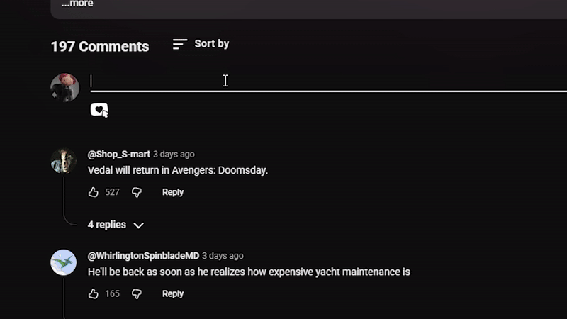
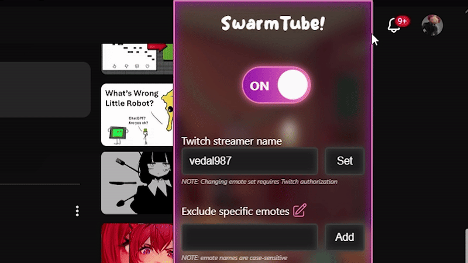

#  SwarmTube

This repository contains the source code for **SwarmTube**, a browser extension that enhances YouTube's comment section experience by integrating [7TV](https://7tv.app/) emotes and providing features like:

- ## **7TV Emote Picker**
  A user-friendly interface to browse and insert [7TV](https://7tv.app/) emotes directly into YouTube comments.

  
  
- ## **Autocomplete**
  Use colon (**:**) for intelligent suggestions for emotes, making it easier to find and use your favorite emotes.

  
  

- ## **Excluding emotes**
    Have you ever found an emote you don't like? Now you can exclude it from appearing in the comment sections!

    

- ## **Emote resizing**
    Adjust the size of emotes in comments to your preference with our easy-to-use resizing feature.

    

- ## **Swappable emote sets**
    If you're not a [Neuro-sama](https://www.twitch.tv/vedal987) fan, you can switch between different emote sets from your favourite streamers to customize your commenting experience to different communities.

    

> [!NOTE]
> Requires Twitch login to access this feature. Login is optional for other features as of now.

## Installation

**Recommended** way to install SwarmTube is via the [Chrome Web Store](https://chromewebstore.google.com/detail/swarmtube/gejfihckhbenahdkbfalfodepcicmdda).

Alternatively, you can install it manually:
1. Clone this repository to your local machine.
2. Open Chrome and navigate to `chrome://extensions/`.
3. Enable "Developer mode" using the toggle in the top right corner.
4. Click "Load unpacked" and select the cloned repository folder.
5. The extension should now be **installed and active**.